# Organize Code in a GitHub Repository

Use **GitHub Desktop** to clone the repository, organize solution files, and push the changes to GitHub.

---

## Table of Contents
- [Step 1: Download and Login to GitHub Desktop](#step-1-download-and-login-to-github-desktop)
- [Step 2: Clone Your Repository](#step-2-clone-your-repository)
- [Step 3: Organize Your Code](#step-3-organize-your-code)
  - [Fetch and Pull](#fetch-and-pull)
  - [Create and Move Files](#create-and-move-files)
  - [Commit and Push](#commit-and-push)
  - [Verify on GitHub](#verify-on-github)

---

## Step 1: Download and Login to GitHub Desktop

Download **GitHub Desktop** for Windows from the [official website](https://desktop.github.com/) and sign in with your GitHub account. On Ubuntu, follow this [installation guide](https://linuxcapable.com/how-to-install-github-desktop-on-ubuntu-linux/).

  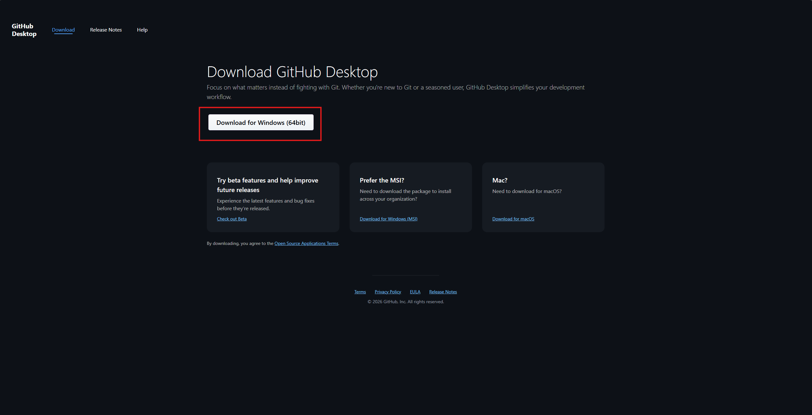

---

## Step 2: Clone Your Repository

Clone the repository to create a local copy that you can edit on your computer.

**2.1.** In GitHub Desktop, choose **Clone a repository from the Internet**.

  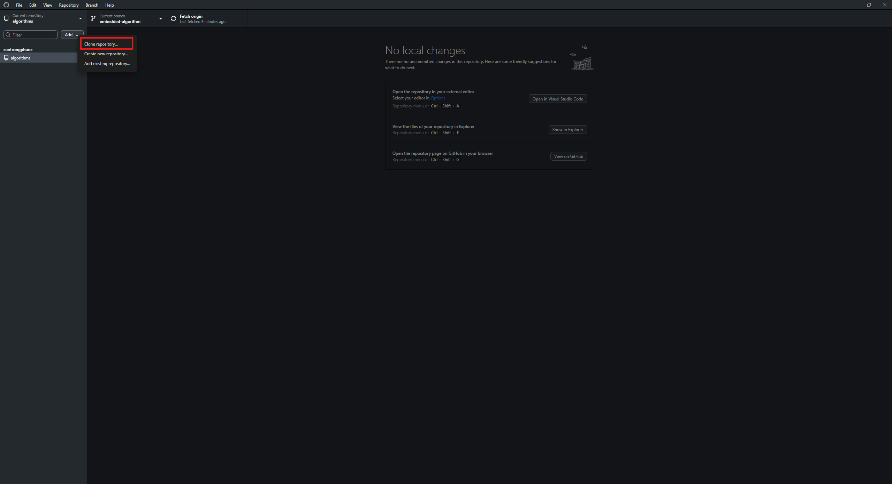

**2.2.** Select the repository you want to clone, choose a local path, then click **Clone**.

  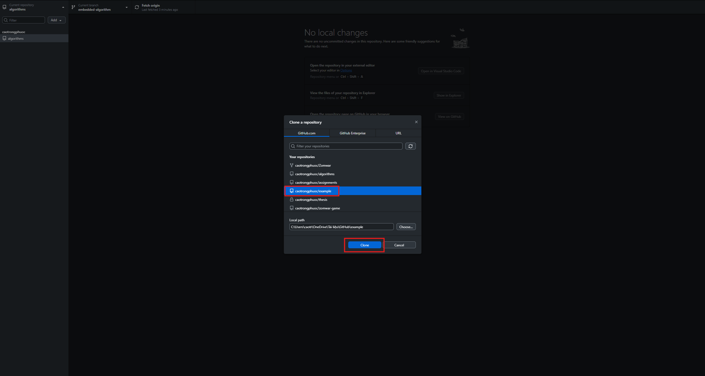

---

## Step 3: Organize Your Code

### Fetch and Pull

**Fetch:** Check for changes on GitHub **without** modifying your local files.

  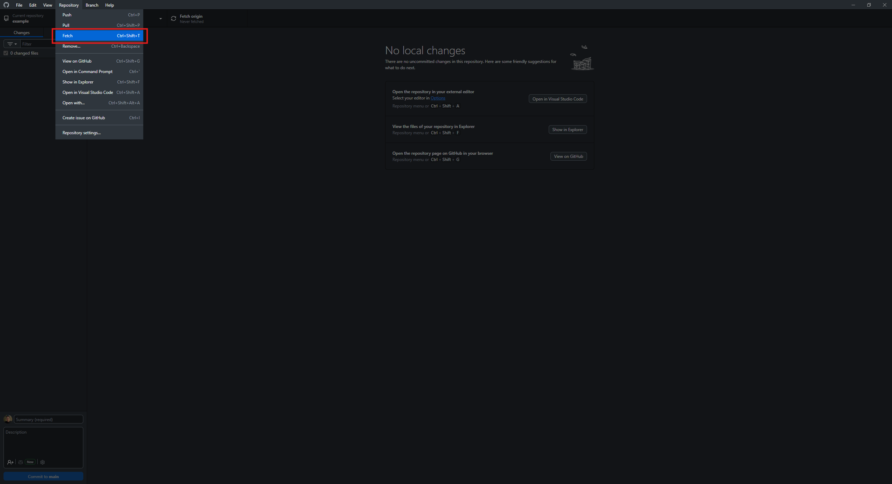

**Pull:** Download changes from GitHub and **merge** them into your current branch.

  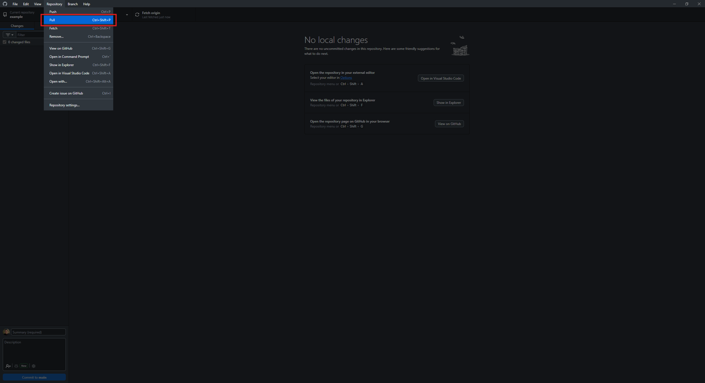

---

### Create and Move Files

**3.1.** Open the repository folder in File Explorer using the **Show in Explorer** option.

  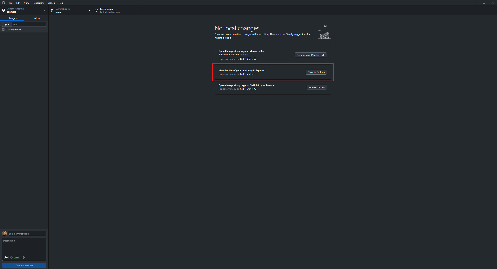

**3.2.** Create a new folder to organize your code by topic or category.

  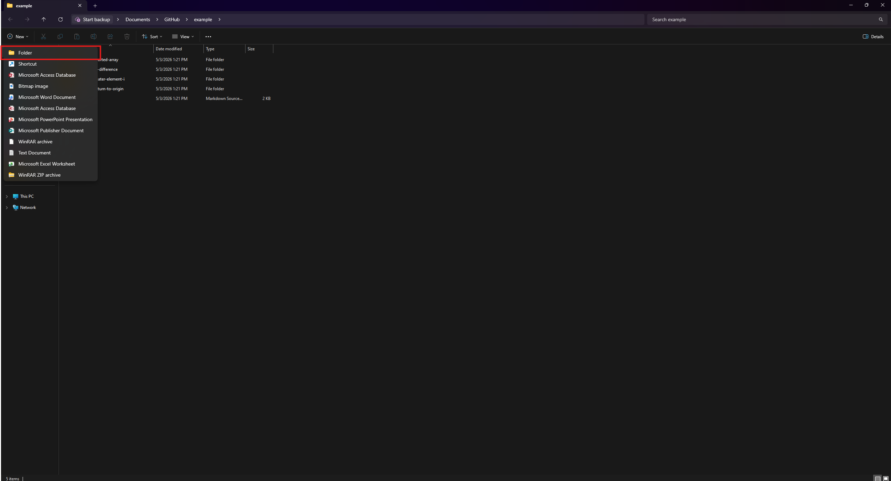

**3.3.** Cut the code files you want to move.

  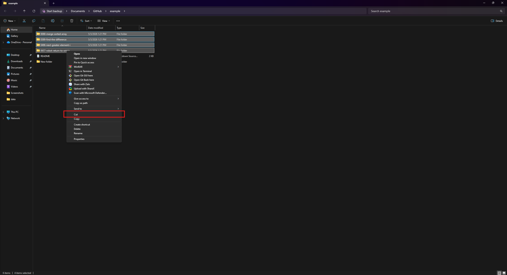

**3.4.** Paste them into the new folder.

  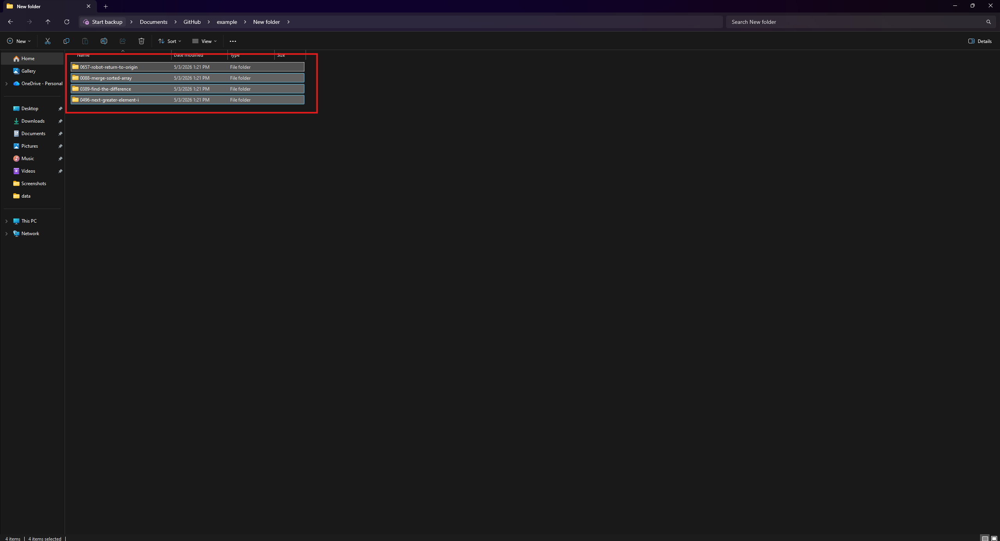

---

### Commit and Push

**3.5.** Back in GitHub Desktop, enter a **Commit Message** describing your changes, then click **Commit to main**.

> **Note:** A commit message is required. For example: `"update leetcode"`.

  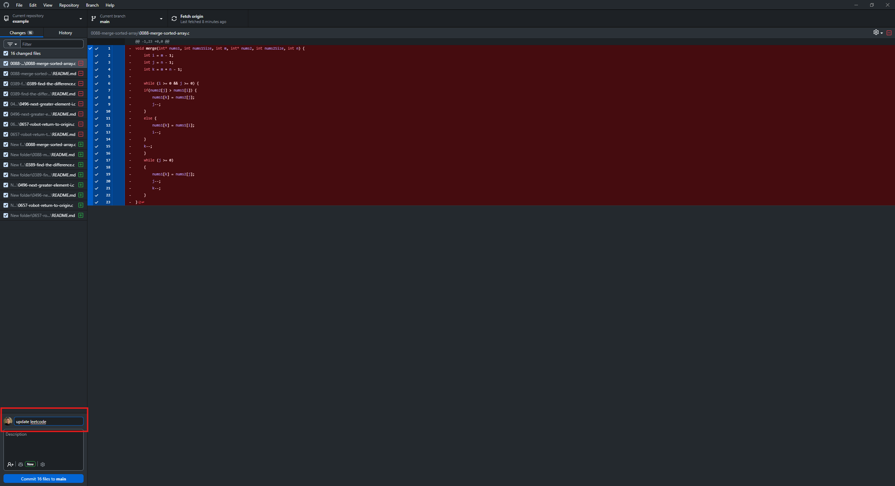

**3.6.** Click **Push origin** to send your local commits to the remote repository on GitHub.

  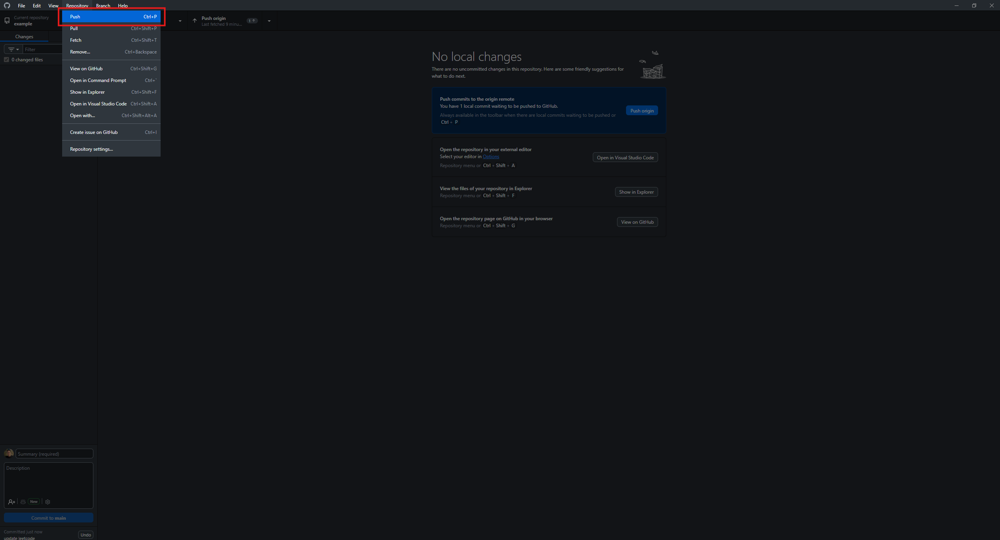

---

### Verify on GitHub

**3.7.** Press **F5** to refresh your GitHub page. The new folder should now appear in your repository.

  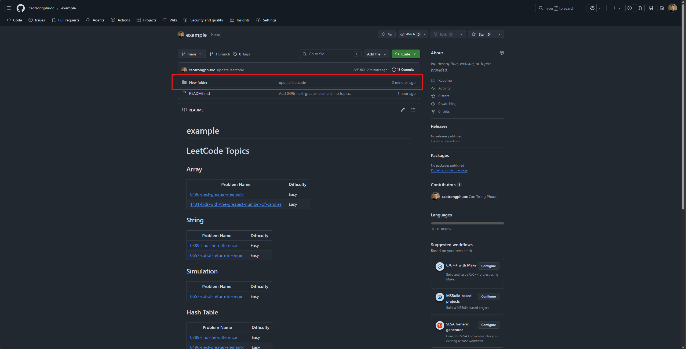

  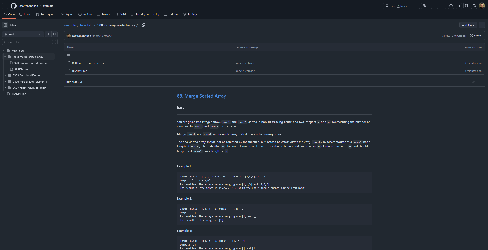

